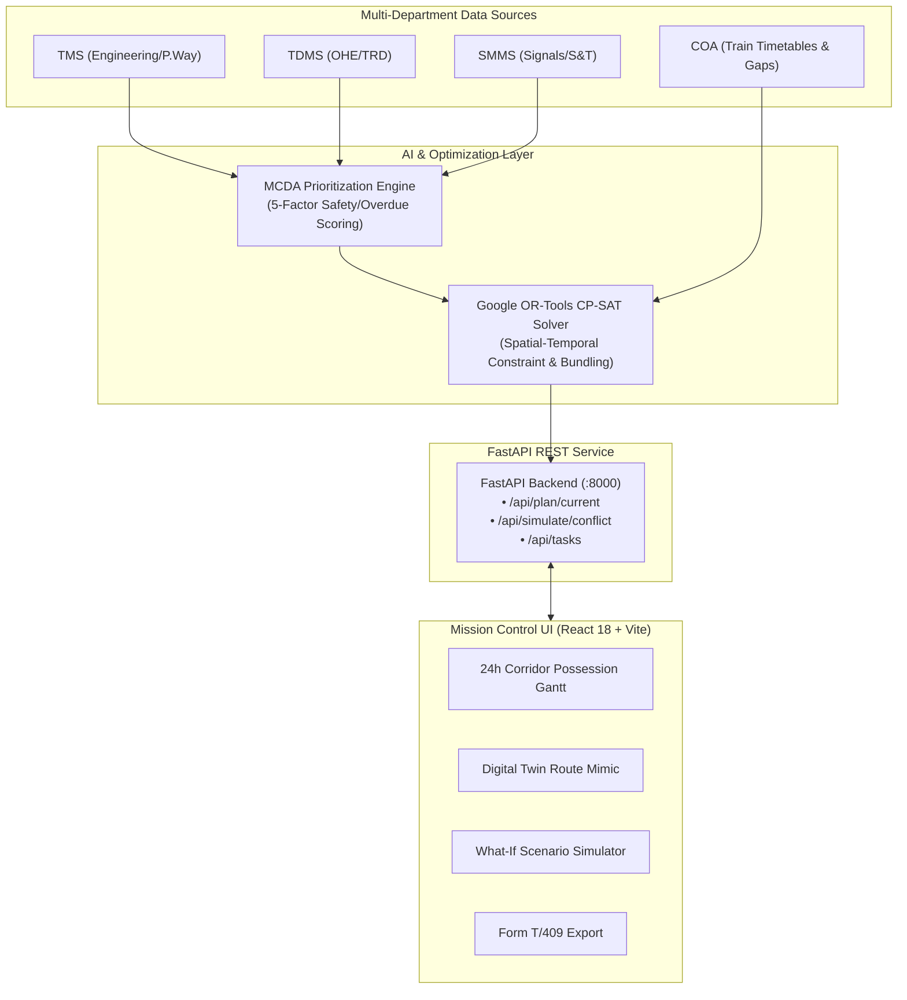

# Indian Railways — AI-Powered Automatic Block Planning System

> **Smart India Hackathon**  
> **Problem Statement:** AI-Powered Automatic Block Planning to Maximize Asset Availability for Train Operations on Indian Railways

---

## 1. Problem Context

Indian Railways infrastructure maintenance is heavily siloed across three major departments:
1. **Engineering (P.Way):** Track defects and renewals logged in **TMS** (Track Management System).
2. **TRD (Traction Distribution):** Overhead equipment (OHE) and power cables logged in **TDMS**.
3. **S&T (Signalling & Telecommunication):** Point machines and interlocking logged in **SMMS**.

Corridor block requests are submitted independently through **BDMS**, completely detached from train timetables and freight traffic in **COA** (Control Office Application). This causes:
* **Conflicting block requests** on the same track section.
* **Uncoordinated maintenance:** Engineering and TRD book separate 2-hour shutdowns on the same section rather than sharing a single possession.
* **Reduced asset availability and train delays.**

---

## 2. The Solution & Key Features

This system provides a clean, automated **AI Decision-Support System** for Railway Section Controllers:

1. **Unified Multi-Department Data Ingestion:**
   * Normalizes defect demands from TMS, SMMS, and TDMS.
   * Maps feasible traffic gaps from COA train timetables along the Prayagraj — Kanpur Central high-density corridor.
2. **Transparent Multi-Criteria AI Prioritization (MCDA):**
   * Computes a 0–100 priority score based on: Safety Severity (Emergency IOM vs Routine), Days Overdue, Corridor Traffic Density (GMT), Statutory Regulations, and Caution Orders / Speed Restrictions.
   * Produces plain-English explanations for controllers (*"Why this defect needs a slot now"*).
3. **Constraint-Based Bundling Optimizer (Google OR-Tools CP-SAT):**
   * Solves the spatial-temporal scheduling problem in seconds.
   * **Multi-Department Co-Scheduling:** Automatically clusters Engineering, TRD, and S&T tasks on the same track section into a single shared possession (achieving 50–75% bundling ratio).
   * Enforces zero spatial collisions and minimum safety buffers.
4. **Interactive Corridor Gantt Matrix & Controller Approval:**
   * Visualizes planned corridor possessions across all sections.
   * Displays multi-department colored tags (`Track`, `OHE`, `Signal`) and bundled badges.
   * **Human-in-the-Loop:** Section Controllers can inspect explainability factor breakdowns and click **Approve** or **Reject** with audit logging.
5. **Real-time Executive KPIs:**
   * Track Asset Availability Rate (>97%).
   * Idle Window Reduction Efficiency (>65%).
   * Co-Scheduled Bundling Ratio (>50%).
   * Overdue Defect Backlog reduction.
6. **Live Upstream Train Delay & Conflict Resolver:**
   * Simulates high-priority train detention (e.g. 12424 Rajdhani delayed by 40 min).
   * Flags headway violations in real time and reschedules conflicting maintenance blocks in <2s with zero passenger stoppage.
7. **Official Indian Railways Form T/409 Block Advice Circular:**
   * Generates formatted Control Office block notices with printable layout and CSV export.

---

## 3. System Architecture



---

## 4. Technology Stack

* **Core Language:** Python 3.12 + TypeScript
* **AI & Optimization:** Google OR-Tools CP-SAT + Multi-Criteria Decision Analysis (MCDA)
* **Backend:** FastAPI (Async REST API, Pydantic v2, CORS)
* **Frontend:** React 18 + Vite + Tailwind CSS + Lucide Icons
* **Data Layer:** Self-contained JSON / In-memory state store (zero external database or Docker dependencies required)

---

## 4. How to Run (1-Command Startup)

### Single Command (Recommended):
Run the master launcher from the project root:
```bash
python run.py
```
This automatically starts both the FastAPI backend (port 8000) and Vite frontend (port 5173), and opens `http://localhost:5173` in your default browser!

### Or Manual 2-Terminal Run:
**Terminal 1 (Backend):**
```bash
.\venv\Scripts\python.exe -m uvicorn backend.app.main:app --host 127.0.0.1 --port 8000 --reload
```
API Documentation will be live at: `http://127.0.0.1:8000/docs`

**Terminal 2 (Frontend):**
```bash
cd frontend
npm run dev
```
Dashboard will be live at: `http://localhost:5173`
